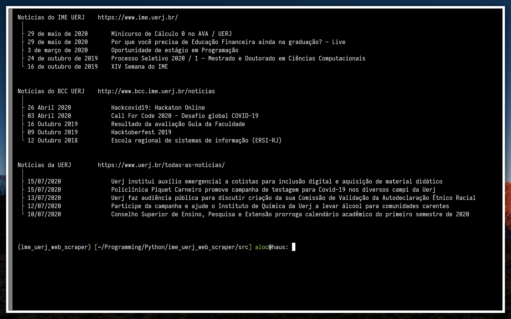

<div align="center">
	<h1>UERJ News Scraper</h1>
	
	<p>UERJ has several news portals, so I decided to write a short python script to extract headlines out of the latest news from the portals I use the most.</p>
</div>
<h3>How to install dependencies:</h2>

``` bash
$ pip install -r requirements.txt
```

<h3>How to run the script:</h2>

``` bash
$ python3 news_scraper.py
```

<h3>Screenshot:</h3>
<div align="center">
	
</div>